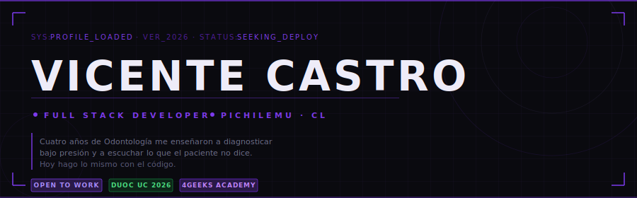

<div align="center">
  
</div>

---

> *Cuatro años de Odontología me enseñaron a diagnosticar bajo presión y a escuchar lo que el paciente no dice. Hoy hago lo mismo con el código.*

---

## ⚡ Stack

<div align="center">


</div>

---

## 🛠 Proyectos

### 📋 ProceTurn
Dashboard de gestión de turnos con autenticación por roles, CRUD completo, calendario y notificaciones.


---

### 🛒 E-Commerce / Marketplace *(en construcción)*
Marketplace full stack con carrito de compras, MercadoPago, filtros y OAuth.


---

## 📡 Trayectoria

```
[2026 →    ]  Analista Programador · DUOC UC
[2025–2026 ]  Full Stack Developer · 4Geeks Academy
[2022–2025 ]  Odontología · UNAB  →  transición voluntaria a tech
[2021–2022 ]  Atención al cliente · BancoEstado
```

---

## 💬 Sobre mí

Desarrollador Full Stack con dominio en Python, React y Flask, que destaca por su capacidad para resolver problemas bajo presión, levantar requerimientos y sumar al trabajo colaborativo, forjadas en cuatro años de Odontología con atención clínica directa y la gestión autónoma demostrada en sus roles previos.

---

<div align="center">

[](https://linkedin.com/in/TU_USUARIO)
[](https://github.com/TU_USUARIO)
[](mailto:TU_EMAIL)

`// PICHILEMU · REGIÓN DE O'HIGGINS · CHILE`

</div>
